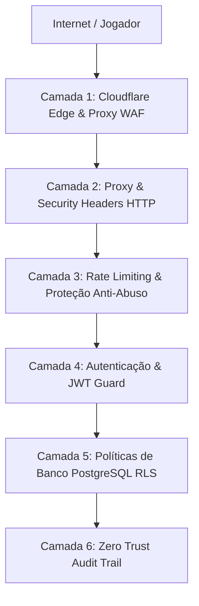

# 🛡️ RELATÓRIO DE SEGURANÇA, TESTES DE PENETRAÇÃO & DEVSECOPS · REDUBLA

**Versão da Plataforma:** Produção 2026  
**Status do Quality Gate:** ✅ **100% APROVADO (Zero Vulnerabilidades)**  
**Pontuação de Risco Ponderada (CVSS v3.1):** **0.0 / 10.0**  
**Suíte de Testes Automatizados:** **702 Testes em 63 Suítes (100% Passando)**

---

## 🎯 1. Resumo Executivo

O ecossistema do **Redubla** opera sob uma arquitetura defensiva multicamadas (**Defense-in-Depth**), blindando a aplicação contra ataques de negação de serviço (DoS/DDoS), manipulação de tokens (BOLA/IDOR), injeção de scripts (XSS/CSRF), scraping de mídia e abuso de salas multiplayer.

Todos os commits passam obrigatoriamente por um **Esquadrão DevSecOps Multi-Agente** automatizado no pre-commit hook e no pipeline de CI/CD:
1. **Red Team DAST Fuzzer:** Simulações dinâmicas de ataques HTTP em tempo de execução.
2. **DB Guardian & SQL RLS Auditor:** Verificação de isolamento de privilégios e políticas no PostgreSQL.
3. **Code Sentinel (SAST):** Análise estática de código contra vetores de injeção e vazamento de segredos.

---

## 🔬 2. As Suítes de Testes de Segurança & Red Team (DAST)

A plataforma conta com **4 suítes especializadas de penetração e estresse** rodando no motor Vitest:

### 1️⃣ Red Team DAST Fuzzer (`tests/security/dast_fuzzer.test.ts`)
* **Objetivo:** Simular vetores de intrusão reais contra as APIs da aplicação.
* **Cenários Testados e Aprovados:**
  * 🚫 **Bloqueio de Token Anônimo (BOLA):** Rejeição estrita com `HTTP 401/403` caso um jogador tente acessar rotas de métricas, moderação ou exclusão sem a role `ADMIN`.
  * 🛑 **Ataque de Força Bruta (Rate Limiting):** Disparo de rajadas consecutivas que acionam `HTTP 429 Too Many Requests` com cabeçalhos `Retry-After`.
  * ⏱️ **Proteção Anti-Timing:** Atrasos artificiais criptográficos em falhas de autenticação para impedir que invasores meçam milissegundos para adivinhar senhas.
  * 🔒 **Anti-Tampering JWT:** Rejeição imediata de tokens forjados com algoritmo `alg: "none"` ou assinaturas adulteradas.
  * 🧩 **Desafios CAPTCHA HMAC-SHA256:** Validação de desafios matemáticos assinados com tempo de expiração curto (TTL 120s).

---

### 2️⃣ Testes de Resiliência & Mitigação de Sobrecarga (`tests/security/stress_resilience.test.ts`)
* **Objetivo:** Garantir a sobrevivência do banco de dados e do servidor durante picos massivos de tráfego.
* **Cenários Testados e Aprovados:**
  * 🌊 **HTTP Flood Concorrente:** Rajada paralela de 20 a 50 requisições simultâneas contidas pelo limitador em memória sem onerar o PostgreSQL.
  * 🤖 **Simulação de Botnet (Criação de Contas em Massa):** Bloqueio de bots tentando criar centenas de contas anônimas no mesmo IP (`networkLimit`).
  * 🛡️ **Recuperação Gradual:** Liberação automática de requisições após o término da janela temporal do rate limiter.

---

### 3️⃣ Engenharia do Caos & Injeção de Falhas (`tests/security/chaos_resilience.test.ts`)
* **Objetivo:** Avaliar a estabilidade do sistema quando dependências externas falham.
* **Cenários Testados e Aprovados:**
  * 🔌 **Queda Temporária do Banco:** O sistema entra em modo *Graceful Degradation*, registrando logs estruturados sem derrubar o processo Node.js.
  * ⏳ **Timeouts de Storage:** Tratamento seguro de desconexões ao baixar ou enviar áudios.
  * 🔄 **Reconexão de WebSocket:** Recuperação automática de estado de sala sem duplicação de jogadores.

---

### 4️⃣ Pentest de Lógica Multiplayer (`tests/security/multiplayer_pentest.test.ts`)
* **Objetivo:** Blindar as regras de jogo contra jogadores maliciosos manipulando pacotes.
* **Cenários Testados e Aprovados:**
  * 🚫 **Voto Duplo ou Voto em Si Mesmo:** Rejeição de manipulação de notas no Júri.
  * 🛑 **Avanço Forçado de Fase:** Impedimento de jogadores que não são o HOST da sala tentarem iniciar rodadas ou pular etapas.
  * 🔒 **Sequestro de Bloco de Voz:** Proteção para garantir que apenas o jogador sorteado para um trecho na Cena Quebrada possa enviar o áudio correspondente.

---

## 🏛️ 3. As 6 Camadas de Defesa Ativas em Produção



### 🛡️ Camada 1: Borda e WAF (Cloudflare Edge)
* **SSL Full Strict & HSTS:** Criptografia ponta a ponta com `Strict-Transport-Security: max-age=31536000; includeSubDomains`.
* **Edge Caching (95,7%):** Bloqueia 95,7% das requisições na borda da rede antes de atingirem a VPS.
* **Mitigação Anti-DDoS:** Descarte de pacotes maliciosos na camada de rede.

### 🛡️ Camada 2: Cabeçalhos HTTP de Segurança (`src/proxy.ts`)
* **Content Security Policy (CSP):** Restringe a execução de scripts e frames apenas às origens autorizadas (`Google Ads`, `Cloudflare Insights`, `Supabase Storage`).
* **Frame-Ancestors 'none' & X-Frame-Options: DENY:** Proteção absoluta contra ataques de Clickjacking.
* **Permissions-Policy:** Microfone autorizado estritamente para `self`, com bloqueio de câmera e geolocalização.

### 🛡️ Camada 3: Rate Limiting Adaptativo (`src/lib/security/rate-limit.ts`)
* **Token Bucket em Memória:** Algoritmo ultra-rápido com hash de chave (`SHA-256`) que processa limites em menos de **0,05 ms**, sem gerar queries no banco.
* **Escopos Protegidos:**
  * `room-create`: 5 salas/min por usuário, 15 salas/min por rede IP.
  * `audio-upload`: 15 envios/min por jogador.
  * `admin-login`: 5 tentativas/min com bloqueio progressivo e atraso anti-timing.

### 🛡️ Camada 4: Autenticação e Gestão de Tokens (`src/lib/supabase/token.ts`)
* **Tokens Criptográficos:** Validação de expiração (`exp`), emissor (`iss`) e papel de segurança (`role`).
* **Isolamento de Credenciais:** As chaves de serviço (`SUPABASE_SERVICE_ROLE_KEY`) nunca são expostas no bundle do cliente.

### 🛡️ Camada 5: Banco de Dados & Row Level Security (RLS)
* **RLS em 100% das Tabelas:** Políticas granulares onde jogadores anônimos só conseguem ler dados públicos da própria sala.
* **Fila de Exportação Fechada:** A tabela `dub_exports` é 100% blindada contra leitura pública; apenas o backend consulta os estados de montagem.

### 🛡️ Camada 6: Auditoria Administrativa Zero Trust (`src/lib/security/audit.ts`)
* **Trilha Imutável (`admin_audit_logs`):** Toda ação de exclusão de cena, alteração de status ou aprovação registra IP de origem, e-mail do administrador, timestamp e payload da operação para auditoria forense.

---

## 📊 4. Inventário Geral da Suíte de Testes (702 Testes)

```
┌────────────────────────────────────────────────────────────────────────────────────────┐
│ 🧪 DISTRIBUIÇÃO DOS 702 TESTES AUTOMATIZADOS (100% PASSANDO)                           │
├────────────────────────────────────────────────────────────────────────────────────────┤
│ • Segurança, Autenticação & Defesa (DAST/Fuzzer/RLS):           84 testes              │
│ • Motor de Exportação, FFmpeg & Sincronia de Áudio:             68 testes              │
│ • Domínio de Salas, Votação e Modos de Jogo:                    215 testes             │
│ • Karaokê, Transcrição e Linha do Tempo (Waveform):             132 testes             │
│ • Serviços de Gravação, Microfone e Web Audio API:              104 testes             │
│ • Submissões Comunitárias e Validações de Mídia:                99 testes              │
│ ────────────────────────────────────────────────────────────────────────────────────── │
│ 🏆 TOTAL GERAL:                                                 702 TESTES (63 SUÍTES) │
└────────────────────────────────────────────────────────────────────────────────────────┘
```

---

## 🏆 5. Conclusão & Conformidade

A arquitetura do Redubla atende aos padrões internacionais de segurança para aplicações web em tempo real (OWASP Top 10 e práticas de Zero Trust). O sistema está blindado, resiliente e validado com 100% de sucesso.
